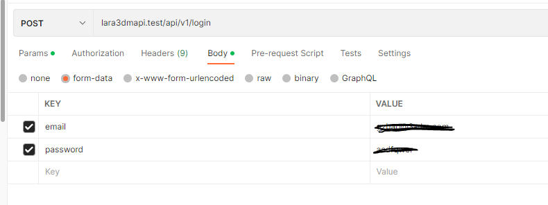
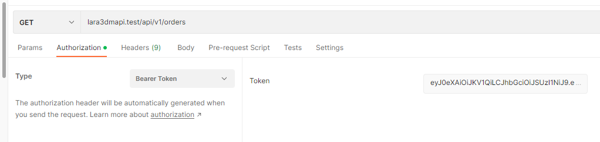
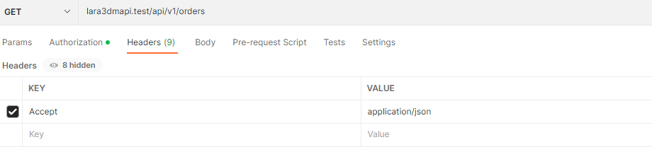
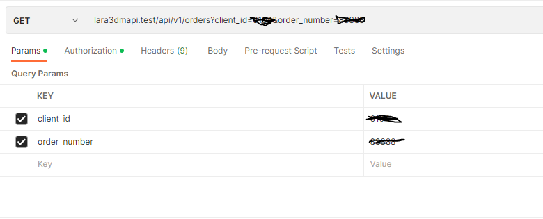

# Bridge-Documents

# Bridge API Documentation

### Base url

`Product : https://brdgeapi.3-dm.com/api/v1`

`QA : https://bridgeqa.3-dm.com/api/v1`


### Response structure
```json
{
    "success": true,
    "data": {
      
      
      
    },
    "message": "..."
}
```
```json
{
  "success": false,
  "message": "...",
  "data": {
    
    
    
  }
}
```
### system constant


| Name             | Value      |
|------------------|---------|
| MAX_NUMBER | 9999999   | 
| MAX_STRING_LENGTH| 191 |
| MAX_TEXT_LENGTH | 255   |
| MAX_IMAGE_SIZE | 2048   |
| MAX_FILE_SIZE| 2048 |


### API Auth configuration:
- Header:
```json
{
  "accept": "application/json",
  "Authorization":"Bearer ********************************"
}
```

# HOW TO MAKE A REQUEST

# for retrieving the token if do not have



# for any http request

## add token


## change header



## make a query or any other types of request(POST, PUT,GET,DELETE)


